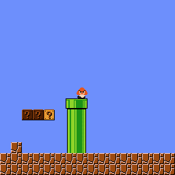

[](https://arxiv.org/abs/2507.00184)

# Mario Diffusion

Generate Mario level scenes with a diffusion model conditioned on text input. These instructions assume you have followed the basic setup instructions in the main [README](../README.md) first.

## Use pretrained models: Preview of final results

We have made various models available on Hugging Face for ease of use. Specifically, one diffusion model of each type described in our paper is available. If you want to use the one that we believe is both the best and easiest to use, then stick to `schrum2/MarioDiffusion-MLM-regular0`. The full list of models is available [here](MODELS.md), but here are instructions on how to use them.

### Command line

To download and interact with a model via the command line, run the following command:
```
python .\text_to_level_diffusion.py --model_path "schrum2/MarioDiffusion-MLM-regular0"
```
This will download the `MLM-regular` model from [this Hugging Face repo](https://huggingface.co/schrum2/MarioDiffusion-MLM-regular0). Once it downloads, you will be asked to enter a caption. Try this:
```
full floor. one enemy. a few question blocks. one platform. one pipe. one loose block.
```
For the rest of the prompts, if you simply press enter, it will skip through the default values. Eventually, a level scene will pop up. It should look like this:



Congratulations! You've generated your first Mario level scene with one of our diffusion models. You can exit the program by providing an input of 'q' to any of the prompts.

Note that if you use a model trained with absence captions, then more information will be expected in the input caption. For example, you can use the `MLM-absence` model with this command:
```
python .\text_to_level_diffusion.py --model_path "schrum2/MarioDiffusion-MLM-absence0"
```
But the caption corresponding to the one above would be:
```
full floor. one enemy. a few question blocks. one platform. one pipe. one loose block. no ceiling. no upside down pipes. no coin lines. no coins. no towers. no cannons. no ascending staircases. no descending staircases. no rectangular block clusters. no irregular block clusters. no question blocks. no loose blocks.
```
To avoid the need to always provide the absence information, you can use the `--automatic_absence_captions` option like this:
```
python .\text_to_level_diffusion.py --model_path "schrum2/MarioDiffusion-MLM-absence0" --automatic_absence_captions
```
This means that you can provide input captions without any absence phrases, but they will be added automatically to the input to the model.

If you interact with a model that supports negative text guidance, such as `schrum2/MarioDiffusion-MLM-negative0`, then there will be an additional input called 'negative_prompt'. However, we recommend using the `--automatic_negative_captions` option so that this extra prompt goes away and is instead handled automatically. Simply run this command:
```
python .\text_to_level_diffusion.py --model_path "schrum2/MarioDiffusion-MLM-negative0" --automatic_negative_captions
```

Feel free to experiment with the other input prompts. Here is some information on each value:

1. `width`: You can generate longer or shorter levels. The models may have more trouble following your text guidance in this case, but results will be generated.
2. `start_seed` and `end_seed`: If you change these, then be sure to set `start_seed <= end_seed`, as the model will be used to generate multiple levels with different random seeds.
3. `num_inference_steps`: How many times the model is executed. The noise output of the model is subtracted from the input, and the process is repeated with more noise removed each time until a (hopefully) completely denoised result is generated.
4. `guidance_scale`: Influences the balance between unconditional generation and adherence to the provided text guidance when levels are generated.
5. `Do you want to play this level? (y/n)`: This is asked after the level is generated but before you see it. If 'y' is selected, then an A* agent will play the level.

As useful as this tool is, we feel that most will have more fun generating levels with the GUI described next.

### Graphical User Interface

There is also a cool GUI you can work with to build larger levels out of diffusion-generated scenes. Run the following command to load the `MLM-regular` model in the GUI and create new levels interactively (**Note**: sufficiently large screen resolution will be needed to view all GUI elements).

```
python interactive_tile_level_generator.py --model_path schrum2/MarioDiffusion-MLM-regular0 --load_data Game_Mario/DATA/Mar1and2_LevelsAndCaptions-regular.json
```

**DETAILS:**
1. Adjust the 'Number of Images' or change the 'Random Seed', and click the 'Generate Image' button to generate new levels. 
2. For more control of the content generated, use the drop down menus on the right side of the GUI. Here you can construct a caption for text guidance by checking boxes. A caption can also be typed directly into the 'Constructed Caption' box.
3. For larger levels, you can adjust the 'Width' and 'Height', but directly generating unusually shaped levels with the diffusion model can lead to weird results. Alternatively, you can compose larger levels from generated content by clicking the 'Add to Level' button under a specific level scene that was made. 
4. Once scenes are added to larger composed levels, click on the thumbnails you would like to delete or rearrange.
5. You may also play or run A* Mario on any generated level or composed larger level, and you can toggle between SNES and NES graphics with the 'Use SNES Graphics' checkbox.
6. Save composed larger levels as ASCII text files by clicking on 'Save Composed Level.'
7. There is an input box for a 'Negative Prompt', but you should not expect this to do anything useful unless you are using a model trained with negative guidance, such as `schrum2/MarioDiffusion-MLM-negative0`. Even then, we recommend simply checking the box for 'Automatic Negative Captions' to assure consistent input.
8. If you are working with a model trained on absence captions, then when launching the GUI, you should specify this with `--load_data Game_Mario/DATA/Mar1and2_LevelsAndCaptions-absence.json` so that the phrase options on the right include absence phrases. However, when using models trained on absence captions, we recommend checking the 'Automatic Absence Captions' box.

We hope these tools for interacting with pre-trained models provide you with a fun way of seeing what is possible with diffusion models. If you would like to train models yourself, then continue to the instructions below.

## Batch Files

Our code was developed on Windows machines, so we have made extensive use of batch files for convenience. However, these will not work on Linux/Mac systems. The Python scripts that are called from these batch files should work on any system, though this has not been fully tested. The instructions below describe how to use the batch files first, but later in this file, details on using the various Python scripts directly are provided.

## Create datasets

All the datasets you need are already in the directory named `Game_Mario/DATA`, so you can feel free to skip this section. If you choose to go through these steps, then the content in the `Game_Mario/DATA` directory should be overwritten with files that are identical to what is already there.

First, you will need to check out 
[my forked copy of TheVGLC](https://github.com/schrum2/TheVGLC). Note that the following command should be executed in the parent directory of the `MarioDiffusion` repository so that the directories for `MarioDiffusion` and `TheVGLC` are next to each other in the same directory:
```
git clone https://github.com/schrum2/TheVGLC.git
```
Once you have my version of `TheVGLC` and `MarioDiffusion`, go into the `Game_Mario/BATCH` sub-directory in the `MarioDiffusion` repo.
```
cd MarioDiffusion
cd Game_Mario
cd BATCH
```
Next, run a batch file to create datasets from the VGLC data. This batch file call will create sets of 16x16 level scenes of both SMB1 and SMB2 (Japan), as well as a combination of both. Afterwards, it will create captions for all 3 datasets, tokenizers for the data, random test captions for later evaluation, and finally splits the data into training, validation, and testing json files. These files will overwrite the files already in the repo, but they should be identical.
Run this command:
```
Mar1and2-data.bat
```
Now you can browse level scenes and their captions with a command like this (the json file can be replaced by any levels and captions json file in datasets):
```
python ascii_data_browser.py Game_Mario/DATA/Mar1and2_LevelsAndCaptions-regular.json 
```
This is not required, but will give you insight into the data.

### Datasets with longer levels
To create larger datasets with custom level width, simply call the same batch file above with an additional integer width argument:
```
Mar1and2-data.bat {width} 
```
This will create the same group of datasets, but will append the width after `Mar1and2` in the name, as in `Mar1and2_32` for 32x16 levels. Although you can create datasets of any size, the diffusion model requires dimensions divisible by 4 to work.

You can also create a single dataset that mixes several widths together.
```
Mar1and2Mixed-data.bat
```
This command generates the datasets at widths 16, 32, 64, and 128 and combines all four into one mixed-width dataset named `Mar1and2_16-32-64-128` (along with its tokenizer and random-test captions). Note that the combined files are very large (hundreds of MB) and are not present in the repo, so you must run this batch file yourself before training on the mixed dataset. See [Training on the large mixed-width dataset](#training-on-the-large-mixed-width-dataset) below for how to train on it.

## Complete training and evaluation sequence

The next two sections go into detail on training both the text encoder and the diffusion model, but if you want to train the whole thing all at once and use default settings from our paper, we have some batch files you can use. Be forewarned that after training, these batch files will also embark on a somewhat lengthy data collection process used to evaluate the models, so if you just want to train a model and then play with it yourself, you might want to skip to the more specific instructions below. If you want to use these batch files, you will need to be in the actual batch directory first:
```
cd batch
```
Once here, you can train both a text encoder and its corresponding diffusion model back to back with a single command like this:
```
train-diffusion.bat 0 Mar1and2 regular Mario MLM
```
The `0` is an experiment number which can be replaced with any integer. Both `Mar1and2` and `regular` are referring to portions of the dataset file names that will be used for training, though they also indicate some settings for the model. For example, you can switch `regular` to `absence` and a different style of captions will be used for training. If you switch it to `negative` then negative guidance will be used during training, allowing for negative prompts during inference. 
The final parameter, `Mario`, makes it clear that we are training a model for standard Super Mario Bros.
Note that immediately after training, this batch file will create various output samples and also evaluate the performance of the model in terms of caption adherence score, which takes a while extra.
If you know you want to repeat an experiment multiple times and train multiple copies of the same model (and evaluate all of them), then you can use this command:
```
batch_runner.bat train-diffusion.bat 0 4 Mar1and2 regular Mario MLM
```
This trains models for experiment numbers 0 through 4 in sequence. Also, the primary focus of our work is on training diffusion models that use simple text encoders, but our paper also compares against models using pretrained sentence transformers. Here is an example:
```
train-diffusion.bat 0 Mar1and2 regular Mario MiniLM multiple
```
This command trains one diffusion model that uses `MiniLM` as its text model, and the `multiple` parameter means that individual phrases from the Mario captions each get their own embedding vector. You can replace this with `single` to embed each caption with a single vector, and you can also swap `MiniLM` with `GTE`, which is a larger embedding model. Note that the first time either `MiniLM` or `GTE` is used, the corresponding text embedding model will need to be downloaded from Hugging Face. The associated diffusion models also take longer to train, and it is not really worth the extra time, but you are welcome to experiment.

For the experiments in our paper, we trained different numbers of models with each configuration, based on how computationally intensive the training was. To create all of the models that we trained for the paper, you would need to run all of the following commands (we ran each command on a separate machine to distribute the training, and then combined the results later for processing):
```
batch_runner.bat train-diffusion.bat 0 9 Mar1and2 regular Mario MLM
batch_runner.bat train-diffusion.bat 0 9 Mar1and2 absence Mario MLM
batch_runner.bat train-diffusion.bat 0 9 Mar1and2 negative Mario MLM
batch_runner.bat train-diffusion.bat 0 9 Mar1and2 regular Mario MiniLM single
batch_runner.bat train-diffusion.bat 0 9 Mar1and2 absence Mario MiniLM single
batch_runner.bat train-diffusion.bat 0 9 Mar1and2 negative Mario MiniLM single
batch_runner.bat train-diffusion.bat 0 4 Mar1and2 regular Mario MiniLM multiple
batch_runner.bat train-diffusion.bat 0 4 Mar1and2 absence Mario MiniLM multiple
batch_runner.bat train-diffusion.bat 0 4 Mar1and2 negative Mario MiniLM multiple
batch_runner.bat train-diffusion.bat 0 4 Mar1and2 regular Mario GTE single
batch_runner.bat train-diffusion.bat 0 4 Mar1and2 absence Mario GTE single
batch_runner.bat train-diffusion.bat 0 4 Mar1and2 negative Mario GTE single
train-diffusion.bat 0 Mar1and2 regular Mario GTE multiple
train-diffusion.bat 0 Mar1and2 absence Mario GTE multiple
train-diffusion.bat 0 Mar1and2 negative Mario GTE multiple
batch_runner.bat train-diffusion.bat 0 29 Mar1and2 none Mario 
batch_runner.bat train-wgan.bat 0 29 Mar1and2 Mario
batch_runner.bat train-fdm.bat 0 29 Mar1and2 regular Mario MiniLM
batch_runner.bat train-fdm.bat 0 29 Mar1and2 absence Mario MiniLM
batch_runner.bat train-fdm.bat 0 29 Mar1and2 regular Mario GTE
batch_runner.bat train-fdm.bat 0 29 Mar1and2 absence Mario GTE
```
Note that the list above also mentions `train-fdm.bat` and `train-wgan.bat`. These are used to train comparison models mentioned in the paper. Their usage is detailed further below.

Now, if you just want to train a model step by step, keep reading from here.

## Train text encoder

Masked language modeling is used to train the text embedding model. Use whatever dataset you like with an appropriate tokenizer. It is recommended to supply the validation and test datasets of the same type as well, though it is optional, and only used for evaluation.
```
python train_mlm.py --epochs 300 --save_checkpoints --json Game_Mario/DATA/Mar1and2_LevelsAndCaptions-regular-train.json --val_json Game_Mario/DATA/Mar1and2_LevelsAndCaptions-regular-validate.json --test_json Game_Mario/DATA/Mar1and2_LevelsAndCaptions-regular-test.json --pkl Game_Mario/DATA/Mar1and2_Tokenizer-regular.pkl --output_dir Mario-Mar1and2-MLM-regular0 --seed 0
```
A report evaluating the accuracy of the final model on the training data can be produced with this command:
```
python evaluate_masked_token_prediction.py --model_path Mario-Mar1and2-MLM-regular0 --json Game_Mario/DATA/Mar1and2_LevelsAndCaptions-regular-train.json
```
You can also see how the accuracy on the training set changes throughout training by evaluating all checkpoints with this command:
```
python evaluate_masked_token_prediction.py --model_path Mario-Mar1and2-MLM-regular0 --compare_checkpoints --json Game_Mario/DATA/Mar1and2_LevelsAndCaptions-regular-train.json
```
To see accuracy on the validation set over time instead, run this command:
```
python evaluate_masked_token_prediction.py --model_path Mario-Mar1and2-MLM-regular0 --compare_checkpoints --json Game_Mario/DATA/Mar1and2_LevelsAndCaptions-regular-validate.json
```

## Train text-conditional diffusion model

Now that the text embedding model is ready, train a diffusion model conditioned on text embeddings from the descriptive captions. Note that this can take a while. We used relatively modest consumer GPUs, so our models took about 12 hours to train. However, you can lower the number of epochs to 300 or even 200 and still get decent results:
```
python train_diffusion.py --save_image_epochs 20 --augment --text_conditional --output_dir Mario-Mar1and2-conditional-regular0 --num_epochs 500 --json Game_Mario/DATA/Mar1and2_LevelsAndCaptions-regular-train.json --val_json Game_Mario/DATA/Mar1and2_LevelsAndCaptions-regular-validate.json --pkl Game_Mario/DATA/Mar1and2_Tokenizer-regular.pkl --mlm_model_dir Mario-Mar1and2-MLM-regular0 --plot_validation_caption_score --seed 0
```
Another trick if you care more about speed than seeing intermediate results is to set `--save_image_epochs` to a large number (larger than the number of epochs), like this
```
python train_diffusion.py --save_image_epochs 1000 --augment --text_conditional --output_dir Mario-Mar1and2-conditional-regular0 --num_epochs 500 --json Game_Mario/DATA/Mar1and2_LevelsAndCaptions-regular-train.json --val_json Game_Mario/DATA/Mar1and2_LevelsAndCaptions-regular-validate.json --pkl Game_Mario/DATA/Mar1and2_Tokenizer-regular.pkl --mlm_model_dir Mario-Mar1and2-MLM-regular0 --plot_validation_caption_score --seed 0
```
You can also train with negative prompting by adding an additional flag like this
```
python train_diffusion.py --save_image_epochs 20 --augment --text_conditional --output_dir Mario-Mar1and2-conditional-negative0 --num_epochs 500 --json Game_Mario/DATA/Mar1and2_LevelsAndCaptions-regular-train.json --val_json Game_Mario/DATA/Mar1and2_LevelsAndCaptions-regular-validate.json --pkl Game_Mario/DATA/Mar1and2_Tokenizer-regular.pkl --mlm_model_dir Mario-Mar1and2-MLM-regular0 --plot_validation_caption_score --seed 0 --negative_prompt_training
```

## Generate levels from text-conditional diffusion model

To generate unconditional levels (not based on text embeddings), use this batch file:
```
batch\run_diffusion_multi.bat Mario-Mar1and2-conditional-regular0 regular Mario
```
This batch file automatically creates 2 different sets of 100 samples, one set that is 16 blocks wide, and another that is 128 blocks wide. If you'd like to run just one of these commands, or customize the output further, you can with this command:
```
python run_diffusion.py --model_path Mario-Mar1and2-conditional-regular0 --num_samples 100 --save_as_json --output_dir Mario-Mar1and2-conditional-regular0-unconditional-samples --level_width 16 --game Mario
```
Captions will be automatically assigned to the levels, and you can browse that data with this command:
```
python ascii_data_browser.py Mario-Mar1and2-conditional-regular0-unconditional-samples\all_levels.json
```
But to actually provide captions to guide the level generation, use this command
```
python text_to_level_diffusion.py --model_path Mario-Mar1and2-conditional-regular0 --game Mario
```
This is the same command that was discussed in detail earlier with respect to pretrained models from Hugging Face, but now the locally trained model is being used. Similarly, the GUI described earlier in this README can also be used with locally trained models, like so:
```
python interactive_tile_level_generator.py --model_path Mario-Mar1and2-conditional-regular0 --load_data Game_Mario/DATA/Mar1and2_LevelsAndCaptions-regular.json --game Mario
```
As indicated in the instructions earlier, additional settings are recommended when working with models trained on absence captions or negative captions.

You can also interactively evolve level scenes in the latent space of the conditional model:
```
python evolve_interactive_conditional_diffusion.py --model_path Mario-Mar1and2-conditional-regular0 --game Mario
```
This tool is a prototype that was not mentioned in the paper, but is another fun way to generate levels.

## Evaluate caption adherence of text-conditional diffusion model

You can evaluate the final model's ability to adhere to input captions with this command:
```
python evaluate_caption_adherence.py --model_path Mario-Mar1and2-conditional-regular0 --save_as_json --json Game_Mario/DATA/Mar1and2_LevelsAndCaptions-regular.json --output_dir text-to-level-final --game Mario
```
You can also evaluate how caption adherence changed during training with respect to the testing set:
```
python evaluate_caption_adherence.py --model_path Mario-Mar1and2-conditional-regular0 --save_as_json --json Game_Mario/DATA/Mar1and2_LevelsAndCaptions-regular-test.json --compare_checkpoints --game Mario
```
However, it is easy to match captions that are similar to real game captions. You can evaluate how caption adherence changed during training with respect to previously unseen randomly generated captions too:
```
python evaluate_caption_adherence.py --model_path Mario-Mar1and2-conditional-regular0 --save_as_json --json Game_Mario/DATA/Mar1and2_RandomTest-regular.json --compare_checkpoints --game Mario
```
If you'd like to create all the generated data used to evaluate caption adherence, as in our paper, you can do so by running the batch file like this:
```
batch\evaluate_caption_adherence_multi.bat Mario-Mar1and2-conditional-regular0 regular Mar1and2 Mario
```
If you used `train-diffusion.bat` to train models (mentioned earlier), then the caption adherence checks mentioned above were already carried out automatically after training.

## Train unconditional diffusion models

To train an unconditional diffusion model without any text embeddings, run this command:
```
python train_diffusion.py --augment --output_dir Mario-Mar1and2-unconditional0 --num_epochs 500 --json Game_Mario/DATA/Mar1and2_LevelsAndCaptions-regular-train.json --val_json Game_Mario/DATA/Mar1and2_LevelsAndCaptions-regular-validate.json --seed 0 --game Mario
```
You can also use this batch file:
```
cd batch
train-diffusion.bat 0 Mar1and2 none Mario
```

## Generate levels from unconditional model

Just like with the text conditional model, you can get level samples from the batch file or a seperate command. The batch file still generates 2 sets of 100 samples, but the arguments are a little different
```
batch\run_diffusion_multi.bat Mario-Mar1and2-unconditional0 regular Mario
```
As before, to get more control, you can simply run this once from the command line
```
python run_diffusion.py --model_path Mario-Mar1and2-unconditional0 --num_samples 100 --save_as_json --output_dir Mario-Mar1and2-unconditional0-unconditional-samples --game Mario --level_width 16
```
View the saved levels in the data browser
```
python ascii_data_browser.py Mario-Mar1and2-unconditional0-unconditional-samples\all_levels.json
```
Interactively evolve level scenes in the latent space of the unconditional model:
```
python evolve_interactive_unconditional_diffusion.py --model_path Mario-Mar1and2-unconditional0 --game Mario
```

## Train Generative Adversarial Network (GAN) model

GANs are an older technology, but they can also be trained to generate levels:
```
python train_wgan.py --augment --json Game_Mario/DATA/Mar1and2_LevelsAndCaptions-regular.json --num_epochs 5000 --nz 32 --output_dir Mario-Mar1and2-wgan0 --seed 0 --game Mario
```
Just like with the diffusion model, you can save a little bit of time by cutting out intermediate results like this
```
python train_wgan.py --augment --json Game_Mario/DATA/Mar1and2_LevelsAndCaptions-regular.json --num_epochs 5000 --nz 32 --output_dir Mario-Mar1and2-wgan0 --seed 0 --game Mario --save_image_epochs 10000
```
You can also use the batch file instead (this will also generate levels with the wgan):
```
cd batch
train-wgan.bat 0 Mar1and2 Mario
```

## Generate levels from GAN

Create samples from the final GAN with this command (assuming the batch file hasn't already)
```
python run_wgan.py --model_path Mario-Mar1and2-wgan0\final_models\generator.pth --num_samples 100 --output_dir Mario-Mar1and2-wgan0-samples --save_as_json --game Mario
```
View the saved levels in the data browser
```
python ascii_data_browser.py Mario-Mar1and2-wgan0-samples\all_levels.json
```
Interactively evolve level scenes in the latent space of the GAN model:
```
python evolve_interactive_wgan.py --model_path Mario-Mar1and2-wgan0\final_models\generator.pth --game Mario
```

## Train Five Dollar Model (FDM)

The five-dollar-model is a lightweight feedforward network that trains fast, but has a pretty small maximum performance. They can be trained with a call to the batch file, which will run metrics for you
```
cd batch
train-fdm.bat 0 Mar1and2 regular Mario MiniLM
```
Alternatively, it can be trained individually like so
```
python train_fdm.py --augment --output_dir Mario-Mar1and2-fdm-MiniLM-regular0 --num_epochs 100 --json Game_Mario/DATA/Mar1and2_LevelsAndCaptions-regular-train.json --val_json Game_Mario/DATA/Mar1and2_LevelsAndCaptions-regular-validate.json --pretrained_language_model sentence-transformers/multi-qa-MiniLM-L6-cos-v1 --plot_validation_caption_score --embedding_dim 384 --seed 0 --game Mario
```

## Generate levels from FDM

Create samples from an FDM with this command
```
python text_to_level_fdm.py --model_path Mario-Mar1and2-fdm-MiniLM-regular0 --game Mario
```

## Generating MarioGPT data for comparison

Most of the MarioGPT data is taken care of in this batch file, which can be run like this
```
cd Game_Mario
cd BATCH
MarioGPT-data.bat
```
This batch file generates 96 levels of size 128 using MarioGPT, stores, pads and captions them in the same format as our unconditional models, and then runs metrics on both sliced 16x16 level samples, as well as the full 16x128 generated levels.  

If you'd like to do each of these steps separately, that can be done with this series of commands:

First, the level generation can be done with this command, which saves generated levels in a new folder called MarioGPT_Levels, in both text and image format.
```
python run_gpt2.py --output_dir "MarioGPT_Levels" --num_columns 128
```
Afterwards, this command will take those levels, pad them, and store them in new files in the datasets directory. (The stride variable controls how long individual segments are, the batch file runs this twice to get levels of length 128 and 16)
```
python create_level_json_data.py --output "Game_Mario/DATA/MarioGPT_Levels.json" --levels "MarioGPT_Levels\levels" --stride 16
```
Afterwards, we use this command to give captions to these levels
```
python create_ascii_captions.py --dataset "Game_Mario/DATA/MarioGPT_Levels.json" --output "Game_Mario/DATA/MarioGPT_LevelsAndCaptions-regular.json"
```
And then, lastly, we can use this command to get metrics on the generated levels
```
python calculate_gpt2_metrics.py --generated_levels "Game_Mario/DATA/MarioGPT_LevelsAndCaptions-regular.json" --training_levels "Game_Mario/DATA/Mar1and2_LevelsAndCaptions-regular.json" --output_dir "MarioGPT_metrics"
```

## Comparing model results

Exploration of the time taken to train models, as well as the time to the best epoch can be accomplished by running the following batch file in `Game_Mario/BATCH`:
```
cd Game_Mario
cd BATCH
calculate_runtimes.bat
```
This batch file calls the following batch file to complete all time calculations on every model.
```
calculate_times.bat
```
The output produced above is then used as input by the next script, which aggregates results for plotting.
```
python evaluate_execution_time.py
```
The aggregated results are used to plot the following two figures:

1. A bar plot of mean grouped runtimes for each model with standard error from its individual times:
```
python visualize_best_model_stats.py --input training_runtimes/mean_grouped_runtimes_plus_best.json --output total_time_with_std_err.pdf --plot_type bar --y_axis "group" --x_axis "mean" --x_axis_label "Hours to Train" --convert_time_to_hours --stacked_bar_for_mlm 
```
2. A box plot of individual times by each model:
```
python visualize_best_model_stats.py --input mean_grouped_runtimes.json --output mean_grouped_runtime_box_plot.pdf --plot_type box --x_axis "group" --y_axis "individual_times" --x_axis_label "Models" --y_axis_label "Hours to Train" --convert_time_to_hours --x_tick_rotation 45
```
Lastly, data from best_model_info.json from each model are aggregated for visualization:
```
python best_model_statistics.py
```
The output from this script is used to plot the following four graphs:
1. A box plot for the best epoch of each model type:
```
python visualize_best_model_stats.py --input best_model_info_20250618_162147.json --output best_epoch_box_plot.pdf --plot_type box --x_axis "group" --y_axis "best_epoch" --x_axis_label "Models" --y_axis_label "Best Epoch" --x_tick_rotation 45 
```
2. A violin plot for the best epoch of each model type:
```
python visualize_best_model_stats.py --input best_model_info_20250618_162147.json --output best_epoch_violin_plot.pdf --plot_type violin --x_axis "group" --y_axis "best_epoch" --y_axis_label "Best Epoch" --x_tick_rotation 45 
```
3. A bar plot for the best epoch of each model type:
```
python visualize_best_model_stats.py --input best_model_info_20250618_162147.json --output best_epoch_bar_plot.pdf --plot_type bar --y_axis "group" --x_axis "best_epoch" --x_axis_label "Best Epoch" --x_markers_on_bar_plot 
```
4. A scatter plot for that compares the best caption score by the best epoch:
```
python visualize_best_model_stats.py --input best_model_info_20250618_162147.json --output best_epoch_v_best_caption_score_scatter_plot.pdf --plot_type scatter --y_axis "best_caption_score" --x_axis "best_epoch" --y_axis_label "Best Caption Score" --x_axis_label "Best Epoch" 
```

Evaluating A* Solvability (via simulation of the full game) for each model using up to 100 samples from all_levels.json from each model. This returns astar_result_overall_averages.json, the average across all averages of metrics returned from all A* runs on tested levels. Returns from the following batch file are automatically plotted in plot_metrics.bat (described in the next section.)
```
evaluate-solvability.bat
```

After running this batch file, you can plot these results on their own with the following command:
```
python evaluate_models.py --plot_file astar_result_overall_averages.json --modes real random short --metric "beaten" --plot_label "Percent Beatable Levels" --save
```

Average minimum edit distance (AMED) calculates the edit distance for each level in a level set against a level set. We calculate AMED(self), where the min edit distance is calculated for each level against the remaining levels in the set, and AMED(real), where the min edit distance is calculated for each level in a level set against the entire real level set taken from the VGLC.

All AMED plots and calculations - as well as broken feature generation plots - can be run from `Game_Mario/BATCH`:
```
cd Game_Mario
cd BATCH
plot_metrics.bat
```
This batch file will generate the following plots at once
```
python evaluate_models.py --modes real random short real_full --full_metrics --metric average_min_edit_distance_from_real --plot_label "Edit Distance" --save --output_name "AMED-REAL_real(full)_real(100)_random_unconditional" --loc "best" --legend_cols 1 --errorbar
```
This saves an AMED(real) plot between generated levels against the real dataset
```
python evaluate_metrics.py --real_data --model_path None
```
Resample the original dataset that levels were created on to 100 samples for a fair comparison
```
python evaluate_models.py --modes real random short real_full --full_metrics --metric average_min_edit_distance --plot_label "Edit Distance" --save --output_name "AMED-SELF_real(full)_real(100)_random_unconditional" --loc "lower right" --bbox 1.0 0.1 --errorbar
```
Plots comparison of the AMED between generated levels themselves against different models
```
python evaluate_models.py --modes real random short real_full --full_metrics --metric broken_pipes_percentage_in_dataset --plot_label "Percent Broken Pipes" --save --output_name "BPPDataset_real(full)_real(100)_random_unconditional" --loc "lower right" --legend_cols 2 --errorbar
```
Plots and compares broken pipes as a percentage of the full generated dataset
```
python evaluate_models.py --modes real random short real_full --full_metrics --metric broken_pipes_percentage_of_pipes --plot_label "Percent Broken Pipes" --save --output_name "BPPPipes_real(full)_real(100)_random_unconditional" --loc "lower right" --legend_cols 2 --errorbar
```
Plots and compares broken pipes as a percentage of total pipe mentions
```
python evaluate_models.py --modes real random short real_full --full_metrics --metric broken_cannons_percentage_in_dataset --plot_label "Percent Broken Cannons" --save --output_name "BCPDataset_real(full)_real(100)_random_unconditional" --loc "lower right" --errorbar
```
Plots and compares broken cannons as a percentage of the full generated dataset
```
python evaluate_models.py --modes real random short real_full --full_metrics --metric broken_cannons_percentage_of_cannons --plot_label "Percent Broken Cannons" --save --output_name "BCPCannons_real(full)_real(100)_random_unconditional" --loc "lower right" --errorbar
```
Plots and compares broken cannons as a percentage of total cannon mentions

## Citation

The instructions above are all related to our AIIDE 2025 publication. If you make use of this code, please cite the following paper:
[Text-to-Level Diffusion Models With Various Text Encoders for Super Mario Bros](https://arxiv.org/abs/2507.00184)  

```bibtex
@article{schrum:aiide2025,
  title={Text-to-Level Diffusion Models with Various Text Encoders for Super Mario Bros},
  volume={21},
  url={https://ojs.aaai.org/index.php/AIIDE/article/view/36815},
  DOI={10.1609/aiide.v21i1.36815},
  number={1},
  journal={Proceedings of the AAAI Conference on Artificial Intelligence and Interactive Digital Entertainment},
  author={Schrum, Jacob and Kilday, Olivia and Salas, Emilio and Hagan, Bess and Williams, Reid},
  year={2025},
  month={Nov.},
  pages={110-120}
}
```

More content related to this research is also available at this website:
[https://people.southwestern.edu/~schrum2/mario.html](https://people.southwestern.edu/~schrum2/mario.html)

However, much work has been done with this repo since publication. Further ways of experimenting with the Mario models are described below, and the [main README](../README.md) has links to information on other games that you can train models for.

## Training with Tile Embedding Models

The default manner in which we convert a tile into a form for training is with a one-hot encoding. This means that the channel size of training data has to match the number of tile types, and that the representation of each tile type is disconnected from what it represents. An alternative to this is to train a set of vectors corresponding to each tile type that captions some form of meaningful information about the tile type and its relation to other tile types. This works and has been used by several others in the literature, though in our case it does not seem to result in any meaningful advantage, and in some cases leads to extra complications. Still, please experiment with our code.

First you need a dataset to train the tile embedding model on. We choose to train a model that learns to predict a given tile based on its surrounding tiles, using 3x3 windows on levels from the original VGLC data, so you will actually need to checkout my forked VGLC repo as described earlier in these instructions (the necessary data is not already in the repo). If you have my VGLC repo, then you can create training data for tile embeddings with these commands.
```
python create_tile_level_json_data.py --output "Game_Mario/DATA/SMB1_3x3_tiles.json" --tile_size 3 --levels "..\TheVGLC\Super Mario Bros\Processed"
python create_tile_level_json_data.py --output "Game_Mario/DATA/SMB2_3x3_tiles.json" --tile_size 3 --levels "..\TheVGLC\Super Mario Bros 2 (Japan)\Processed"
python combine_data.py "Game_Mario/DATA/Mar1and2_3x3_tiles.json" "Game_Mario/DATA/SMB1_3x3_tiles.json" "Game_Mario/DATA/SMB2_3x3_tiles.json"
```
Or, instead of running these commands individually, you could just run the following batch file from `Game_Mario/BATCH`:
```
cd Game_Mario
cd BATCH
Mar1and2-tile3x3-data.bat
```
Once the data exists in the `Game_Mario/DATA` directory, you can train a tile embedding model in one of two ways. Train a block2vec model with this command, which uses an embedding dimension of 8:
```
python train_block2vec.py --json_file "Game_Mario/DATA/Mar1and2_3x3_tiles.json" --output_dir "Mario-Mar1and2-block2vec8-embeddings0" --embedding_dim 8 --epochs 200 --batch_size 32
```
The 8 appears in both the output directory and as the parameter to `--embedding_dim`. This parameter sets the length of the embedding vectors. You can set any length you want, but using a value equal to or greater than the number of tile types doesn't serve much purpose, since you could use one-hot encoding instead. The other type of embedding model is based on skipgrams, and can be trained with a command like this:
```
python train_skipgram.py --json_file "Game_Mario/DATA/Mar1and2_3x3_tiles.json" --output_dir "Mario-Mar1and2-skipgram8-embeddings0" --embedding_dim 8 --epochs 200 --batch_size 32
```
If you want the final diffusion model to also be text conditional, then you will need to either train your own MLM model or use a pre-trained text encoder as described above. Diffusion models that use tile embeddings can be trained with text conditioning or without. The `train_diffusion.py` script is used as before, with the only addition being the use of the `--block_embedding_model_path` parameter to specify the save directory of the trained embedding model. This works for block2vec and skipgram. Here is an example using block2vec (which assumes the existance of a previously trained MLM model):
```
python train_diffusion.py --augment --text_conditional --output_dir "Mario-Mar1and2-block2vec8-conditional0" --num_epochs 500 --json Game_Mario/DATA/Mar1and2_LevelsAndCaptions-regular-train.json --val_json Game_Mario/DATA/Mar1and2_LevelsAndCaptions-regular-validate.json --mlm_model_dir "Mario-Mar1and2-MLM-regular0" --block_embedding_model_path "Mario-Mar1and2-block2vec8-embeddings0" --plot_validation_caption_score
```
Once you train a diffusion model, a copy of the tile embedding model is saved in the diffusion model directory and automatically loaded as needed whenever the diffusion model is loaded, which means that all downstream Python scripts used to generate level scenes from models can be used as normal without the need for any additional parameters related to the use of the tile embedding model.


MORE? Batch file?


## Train and generate levels from unconditional model with block2vec tile embedding model (experimental)


To train and run an unconditional model with tile embeddings, you can run this batch file
and opt to include an argument for the size of the latent embedding space by including an integer for the number of embedding dimensions (default 16)
```
batch\Mar1and2-unconditional-embedding.bat (embedding_dims)
```


## Training on the large mixed-width dataset

 **Experimental.** Training a single conditional model on level scenes of mixed widths (16, 32, 64, and 128) is a work in progress. The combined dataset is roughly an order of magnitude larger than a single-width set, so training is slow and VRAM-hungry.

First build the mixed dataset as described under [Datasets with longer levels](#datasets-with-longer-levels):
```
cd batch
Mar1and2Mixed-data.bat
```
This produces `Mar1and2_16-32-64-128_LevelsAndCaptions-regular.json` (split into train/validate/test), the `Mar1and2Mixed_Tokenizer-regular.pkl` tokenizer, and matching random-test captions. These files are large and are not in the repo, so you have to generate them yourself.

To then train a conditional model on this mixed dataset, call the following batch file: 
```
cd batch
train-conditional-mixed.bat 
```
The diffusion training itself handles the variable widths by bucketing scenes of the same width into each batch. 


